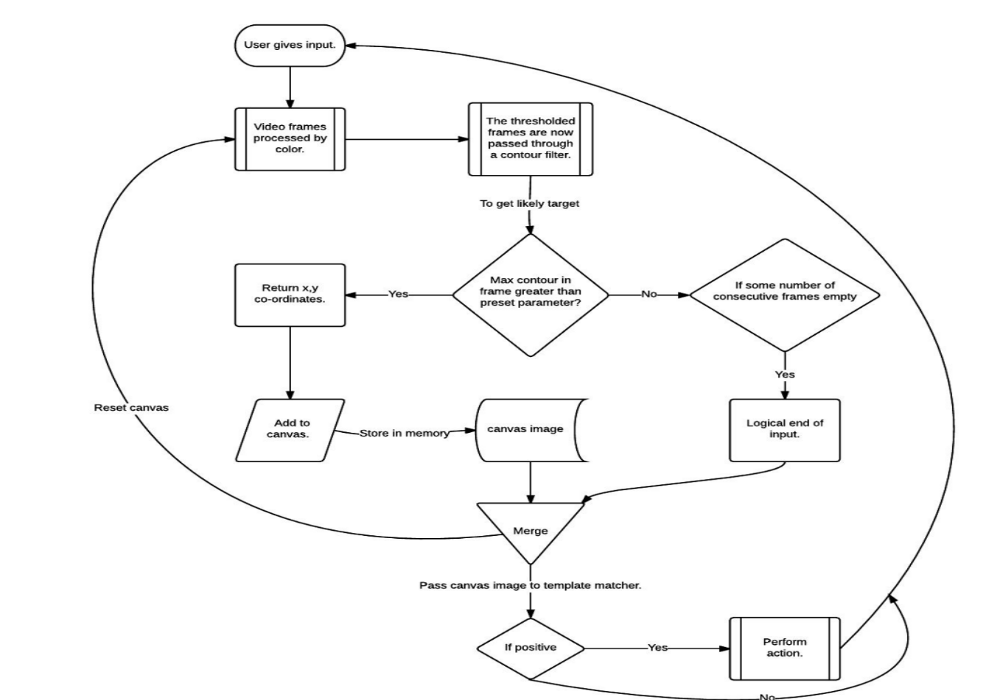

Project Description
-------------------

To design a software which can successfully be used as a  Interactive medium for computers.

Using hand gestures along with standard desktop objects such as Phones and Pens for interacting with the software!

### Architecture

### Detecting hand

 

### Detecting pattern

  

### Detecting fingure gestures
 
  

Approach
--------
--------
Use the hand tracking method to detect , track and sketch the hand.

Probably we will need to use something like the haarcascade or Eigen methods to zero down on the region where the hand is situated

Using Algorithms like Eigenfaces and Neural net works to actualy make the system learn not just to detect the convex/concave points but to be more roboust.

Tools 
- [] Python3
- [] OpenCV
- [] PIL

